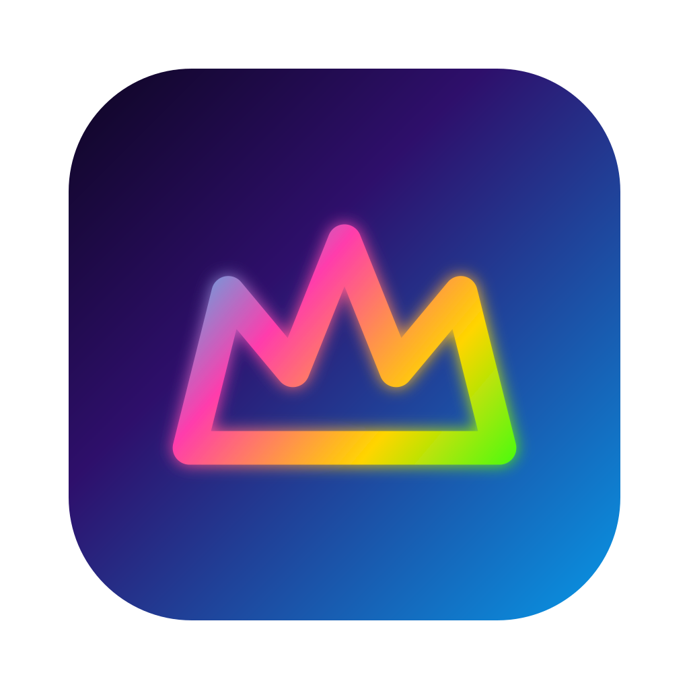

  

<h1 align="center">SlayZone</h1>

  <strong>Mission control for your AI coding agents.</strong>
   
  Manage all your agents from one place — scoped to tasks, tracked automatically.

 

<!-- HERO SCREENSHOT: Replace with actual screenshot -->

  

  &nbsp;&nbsp;
  &nbsp;&nbsp;
  

 

---

 

## Run any number of agents per task

Each task contains one or more integrated terminals. Spin up Claude Code, Codex, or a plain shell — run as many as you need. One agent researching, one coding, one testing, all inside the same task. Real PTY sessions, not sandboxed previews.

<!-- SCREENSHOT: Task detail view with terminal -->

  

 

## Automatic status tracking

SlayZone watches your agents and tracks each task's status automatically — idle, working, or waiting for your input. No more switching between terminals to check what's happening.

<!-- SCREENSHOT: Attention indicator / notification panel -->

  

 

## Built-in browser

Each task has an inline browser with multiple tabs. Preview what your agents are building without leaving the app.

<!-- SCREENSHOT: Inline browser -->

  

 

## Git worktrees, per task

Link a git worktree to any task. One branch per task, automatic isolation, view diffs, stage changes, merge when done. No more stashing half-finished work.

<!-- SCREENSHOT: Git panel / worktree view -->

  

 

---

 

## Contributing

Contributions are welcome! Worth noting is that SlayZone is pretty much built with SlayZone itself.

SlayZone is a pnpm monorepo built with Electron, React, and SQLite.
